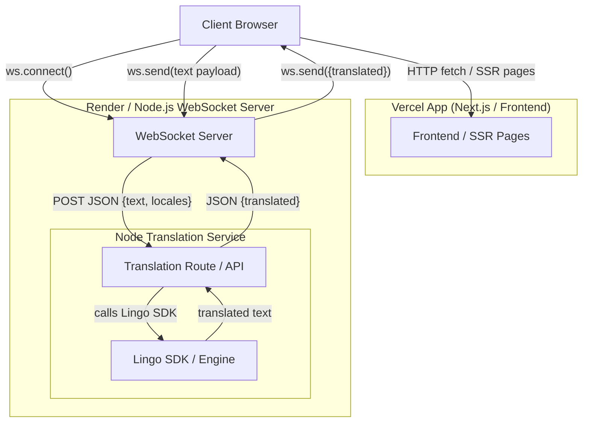

# Architecture

This document describes a production-grade architecture for building a real-time translation system using a dedicated WebSocket server and a Vercel-hosted app, organized using a monorepo with Turbopack.

### Overview 
Vercel Edge Functions cannot run Node-only SDKs (like lingo.dev/sdk) because they rely on Node APIs (fs, crypto, stream). WebSockets require a persistent server, which Edge Functions do not provide reliably for long-lived connections.

To address this, responsibilities are split across two services:

1. WebSocket Server (Render)

- Persistent Node.js server managing WebSocket connections.

- Relays messages from clients to the translation service.

- Ensures low-latency, real-time updates.

2. App Frontend (Vercel)

- Next.js app serving UI.

- Calls the WebSocket server for real-time translation.

### High-Level Architecture
This design follows Vercel’s recommended pattern for combining WebSockets with non-Edge-compatible logic.


### Technical details
1. Monorepo (Turbopack):
```
/lingo.video
├─ /apps
│  ├─ /next-app     # Next.js app deployed on Vercel
│  └─ /ws-server    # Node.js WebSocket server deployed on Render
└─ /packages
   └─ /types        # Shared types
```
2. WebSocket Server uses ws library for real-time communication.
3. Translation Layer uses `lingo.dev/sdk` (Lingo engine) for actual translations.s
4. Tech stack

| Layer              | Technology       |
| ------------------ | ---------------- |
| Frontend           | Next.js (Vercel) |
| WebSocket Server   | Node.js (Render) |
| Translation Engine | `lingo.dev/sdk`, `lingo compiler`  |
| Monorepo           | Turbopack        |
| Language           | TypeScript/Javascript       |
