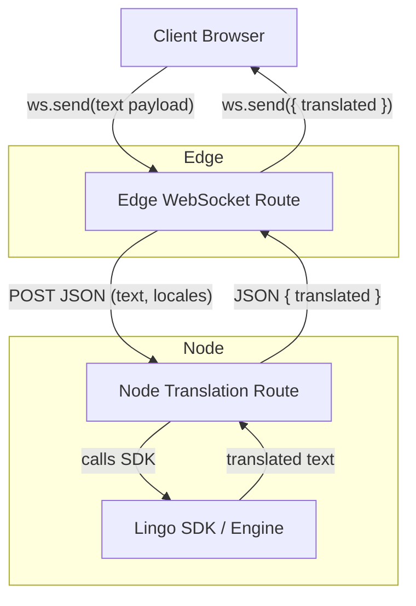

This document describes a production-grade architecture for building a real-time translation system using WebSockets on Vercel Edge and translation logic running in a separate Node.js serverless function.

### Overview 
Vercel Edge Functions provide WebSocket support but do not support Node.js APIs. Many SDKs—including lingo.dev/sdk—require Node APIs like fs, crypto, and stream, making them incompatible with Edge runtime.

To support WebSockets and use the Node-only translation SDK, the architecture splits responsibilities:

- Edge Function: Handles WebSocket connection and real-time communication.

- Node Function: Performs translation using the Node SDK.

### High-Level Architecture
This design follows Vercel’s recommended pattern for combining WebSockets with non-Edge-compatible logic.

